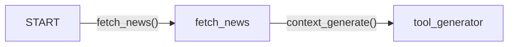

# NewsEventWorker

## Introduction

`NewsEventWorker` polls configured RSS feeds and provides recent headlines to the agent. This allows the agent to surface relevant news catalysts during conversation.

## Implementation

The worker asynchronously downloads RSS or Atom feeds using `httpx` and parses the first few entries with Python's XML utilities. The collected headlines are placed into the `message_flow` for generation using `ToolGenerator.context_generate`.



## Usage

Include the worker in the agent configuration and provide one or more feed URLs via `fixed_args`:

```json
{
  "id": "1a2b3c4d-1111-2222-3333-444455556666",
  "name": "NewsEventWorker",
  "path": "news_event_worker.py",
  "fixed_args": {"feeds": ["https://example.com/rss"]}
}
```